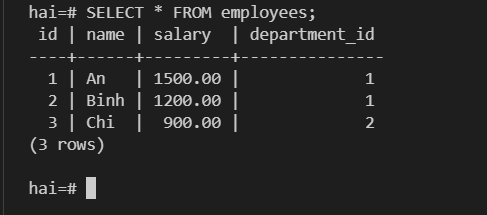
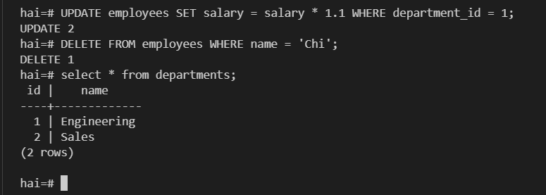
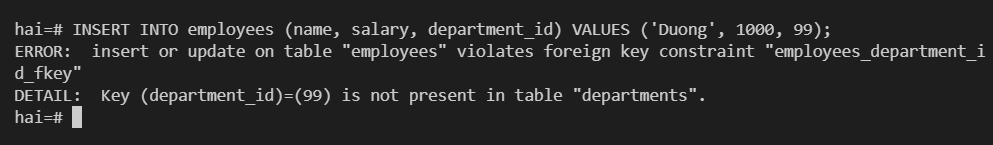

# SQL | POSTGRESQL
**Yêu cầu**
1. Kiến thức: tìm hiểu theo các topic sau (Postgresql)
	+ Overview So sánh điểm mạnh yếu với các SQL Database khác
	+ CRUD
	+ Foreign key
	+ Join
	+ Sub query
	+ Index
	+ Partition
	+ Transaction
2. Thực hành
	- Cài đặt Postgresql
	- Viết example Sử dụng Golang và 1 thư viện ORM (GORM hoặc XORM) để kết nối đến ứng dụng Postgresql đã cài đặt

## Mục lục

- [Lý thuyết](#lý-thuyết)
	- [1. Tổng quan](#1-Tổng-quan)
	- [2. CRUD](#2-crud)
	- [3. Foreign key](#3-foreign-key)
	- [4. Join](#4-join)
	- [5. Sub query](#5-sub-query)
	- [6. Index](#6-index)
	- [7. Partition](#7-partition)
	- [8. Transaction](#8-transaction)
- [Thực hành](#thực-hành)
	- [1. Cài đặt PostgreSQL](#1-cài-đặt-postgresql)
	- [2. Ví dụ Golang + GORM kết nối PostgreSQL](#2-ví-dụ-golang--gorm-kết-nối-postgresql)

## Lý thuyết

### 1. Tổng quan
**SQL (Structured Query Language)** là ngôn ngữ dùng để truy vấn và quản lý dữ liệu trong cơ sở dữ liệu quan hệ.
PostgreSQL là hệ quản trị cơ sở dữ liệu quan hệ - đối tượng (object-relational) opensource,  
Được phát triển từ POSTGRES của Đại học California năm 1986, tên PostgreSQL từ phiên bản 1996.

Đặc điểm PostgreSQL:
	- tuân thủ đầy đủ các thuộc tính ACID (Atomicity, Consistency, Isolation, Durability),  
	- dùng MVCC (Multi-Version Concurrency Control) để xử lý đồng thời, 
	- hỗ trợ kiểu dữ liệu phong phú (JSON/JSONB, Array, Range, UUID,...), 
	- khả năng mở rộng bằng extension (PostGIS, pg_trgm, pg vector,...).

So sánh PostgreSQL với các hệ khác trong SQL.
1. MySQL
	- MySQL: Đơn giản, phổ biến, đọc nhanh cho ứng dụng web nhỏ.
	- PostgreSQL: Tuân thủ chuẩn SQL chặt chẽ hơn, DDL có thể nằm trong transaction, kiểu dữ liệu phong phú hơn (JSONB, Array, Range).

2. SQL Server
	- SQL Server: Tích hợp sâu hệ sinh thái Microsoft, công cụ quản trị (SSMS) mạnh.
	- PostgreSQL: Miễn phí, mã nguồn mở, chạy đa nền tảng (Linux, macOS, Windows).

3. Oracle
	- Oracle: Tối ưu cho hệ thống doanh nghiệp cực lớn, hỗ trợ enterprise 24/7.
	- PostgreSQL: Chi phí license miễn phí, mở rộng dễ bằng extension thay vì mua thêm module.

4. SQLite
	- SQLite: Gọn nhẹ, không cần server, phù hợp ứng dụng nhúng/local, mobile.
	- PostgreSQL: Phục vụ nhiều client đồng thời qua network, đầy đủ tính năng RDBMS (user, role, replication).

> PostgreSQL không có ưu thế khi cần một database cực gọn nhẹ chạy nhúng (SQLite phù hợp hơn), khi hạ tầng đã gắn chặt hệ sinh thái Microsoft (SQL Server tiện hơn), hoặc khi cần gói hỗ trợ enterprise chính thức quy mô lớn như Oracle.

### 2. CRUD

CRUD là 4 thao tác cơ bản: Create, Read, Update, Delete.

```sql
-- Tạo 1 tabl departments, với id là khóa chính, SERIAL 
CREATE TABLE departments (
    id   SERIAL PRIMARY KEY,
    name VARCHAR(100) NOT NULL
);
-- table emloyee, khóa chính id. 
-- employees.department_id là khóa ngoại (Foreign Key) tham chiếu đến departments.id
CREATE TABLE employees (
    id            SERIAL PRIMARY KEY,
    name          VARCHAR(100) NOT NULL,
    salary        NUMERIC(12, 2) NOT NULL,
    department_id INT REFERENCES departments(id)
);

-- Create
INSERT INTO departments (name) VALUES ('Engineering'), ('Sales');
INSERT INTO employees (name, salary, department_id) VALUES
    ('An', 1500, 1),
    ('Binh', 1200, 1),
    ('Chi', 900, 2);

-- Read
SELECT * FROM employees;

-- Update
UPDATE employees SET salary = salary * 1.1 WHERE department_id = 1;

-- Delete
DELETE FROM employees WHERE name = 'Chi';
```

> Kết quả (PostgreSQL docker compose, xem mục [Cài đặt](#1-cài-đặt-postgresql))  
  


### 3. Foreign key

**Foreign Key** trong PostgreSQL là một cột dùng để liên kết một bảng với khóa chính (Primary Key) của bảng khác, giúp đảm bảo tính toàn vẹn dữ liệu.  

```sql
-- employees.department_id tham chiếu departments.id
department_id INT REFERENCES departments(id)

-- Vi phạm FK vì id = 99 không tồn tại trong departments
INSERT INTO employees (name, salary, department_id) VALUES ('Duong', 1000, 99);
```

> Kết quả thực hành: PostgreSQL từ chối insert khi vi phạm ràng buộc.
  


Hành vi của Foreign Key khi record ở bảng cha bị DELETE hoặc UPDATE  

| `ON DELETE / ON UPDATE` | Hành vi |
|---|---|
| `NO ACTION` | Mặc định. Không cho xóa/sửa nếu còn record tham chiếu |
| `RESTRICT` | Tương tự `NO ACTION`, nhưng kiểm tra ngay lập tức |
| `CASCADE` | **Thường gặp** Xóa/sửa luôn các record liên quan ở bảng con |
| `SET NULL` | **Thường gặp** Đặt Foreign Key ở bảng con thành `NULL` |
| `SET DEFAULT` | Đặt Foreign Key ở bảng con về giá trị `DEFAULT` |

### 4. Join

Join kết hợp dữ liệu từ nhiều bảng dựa trên điều kiện liên quan (thường là khóa ngoại). `JOIN` (INNER JOIN) chỉ trả về các dòng khớp ở cả hai bảng; `LEFT JOIN` giữ lại toàn bộ dòng bên trái kể cả khi không khớp.

```sql
SELECT e.name AS employee, d.name AS department
FROM employees e
JOIN departments d ON e.department_id = d.id;
```

> Kết quả thực hành
```
 employee | department
----------+-------------
 An       | Engineering
 Binh     | Engineering
(2 rows)
```

### 5. Sub query

Sub query là một câu `SELECT` được lồng bên trong câu query khác, thường dùng trong mệnh đề `WHERE`, `FROM` hoặc `SELECT`.

```sql
-- Tìm nhân viên có lương cao hơn mức lương trung bình
SELECT name, salary
FROM employees
WHERE salary > (SELECT AVG(salary) FROM employees);
```

> Kết quả thực hành
```
 name | salary
------+---------
 An   | 1650.00
(1 row)
```

### 6. Index

Index tăng tốc độ tìm kiếm bằng cách tạo cấu trúc dữ liệu tra cứu riêng (mặc định là B-tree) thay vì phải quét toàn bộ bảng (sequential scan). Đánh đổi: index tốn thêm dung lượng và làm chậm thao tác ghi (`INSERT`/`UPDATE`/`DELETE`) vì phải cập nhật cả index.

```sql
CREATE INDEX idx_employees_department_id ON employees(department_id);

EXPLAIN SELECT * FROM employees WHERE department_id = 1;
```

> Kết quả thực hành
```
                        QUERY PLAN
-----------------------------------------------------------
 Seq Scan on employees  (cost=0.00..1.02 rows=1 width=242)
   Filter: (department_id = 1)
(2 rows)
```
> Với bảng chỉ có vài dòng, PostgreSQL query planner ước lượng quét toàn bộ bảng (`Seq Scan`) rẻ hơn dùng index, nên vẫn chọn seq scan dù index đã tồn tại. Index chỉ phát huy hiệu quả rõ rệt khi bảng có lượng dữ liệu đủ lớn.

### 7. Partition

Partition chia một bảng logic thành nhiều bảng vật lý con (partition) dựa trên một quy tắc (range, list hoặc hash), giúp truy vấn/maintain hiệu quả hơn trên bảng có dữ liệu rất lớn (ví dụ: chỉ quét đúng partition theo tháng thay vì toàn bộ dữ liệu nhiều năm).

```sql
CREATE TABLE orders (
    id         SERIAL,
    order_date DATE NOT NULL,
    amount     NUMERIC(12, 2) NOT NULL
) PARTITION BY RANGE (order_date);

CREATE TABLE orders_2025 PARTITION OF orders
    FOR VALUES FROM ('2025-01-01') TO ('2026-01-01');

CREATE TABLE orders_2026 PARTITION OF orders
    FOR VALUES FROM ('2026-01-01') TO ('2027-01-01');

INSERT INTO orders (order_date, amount) VALUES
    ('2025-06-15', 100),
    ('2026-03-01', 200);

SELECT tableoid::regclass AS partition, * FROM orders;
```

> Kết quả thực hành: mỗi dòng tự động được lưu vào đúng partition theo `order_date`.
```
  partition  | id | order_date | amount
-------------+----+------------+--------
 orders_2025 |  1 | 2025-06-15 | 100.00
 orders_2026 |  2 | 2026-03-01 | 200.00
(2 rows)
```

### 8. Transaction

Transaction gom nhiều câu lệnh thành một đơn vị "tất cả hoặc không gì cả" (atomic), tuân theo tính chất ACID (Atomicity, Consistency, Isolation, Durability). `COMMIT` lưu thay đổi vĩnh viễn, `ROLLBACK` hủy toàn bộ thay đổi trong transaction.

```sql
-- Chuyển 200 từ lương của An sang Binh trong cùng 1 transaction
BEGIN;
UPDATE employees SET salary = salary - 200 WHERE name = 'An';
UPDATE employees SET salary = salary + 200 WHERE name = 'Binh';
COMMIT;

-- Thử trừ quá mức rồi hủy bỏ toàn bộ thay đổi
BEGIN;
UPDATE employees SET salary = salary - 100000 WHERE name = 'An';
ROLLBACK;
```

> Kết quả thực hành
```
BEGIN
UPDATE 1
UPDATE 1
COMMIT
 name | salary
------+---------
 An   | 1450.00
 Binh | 1520.00
(2 rows)

BEGIN
UPDATE 1
ROLLBACK
 name | salary
------+---------
 An   | 1450.00
(1 row)
```
> Sau `ROLLBACK`, lương của An giữ nguyên `1450.00` thay vì bị trừ `100000`, chứng minh transaction đã hủy bỏ thay đổi chưa commit.

## Thực hành

### 1. Cài đặt PostgreSQL

Sử dụng Docker Compose.

```yaml
services:
  postgres:
    image: postgres:16-alpine
    container_name: postgres-demo
    restart: unless-stopped
    environment:
      POSTGRES_USER: test
      POSTGRES_PASSWORD: test
      POSTGRES_DB: test
    ports:
      - "5432:5432"
    volumes:
      - postgres-data:/var/lib/postgresql/data
    healthcheck:
      test: ["CMD-SHELL", "pg_isready -U test -d test"]
      interval: 5s
      timeout: 5s
      retries: 5

volumes:
  postgres-data:
```

```bash
docker compose up -d
docker compose ps
```

> Kết quả thực hành
```
NAME                IMAGE                COMMAND                  SERVICE    STATUS                    PORTS
postgres-demo   postgres:16-alpine   "docker-entrypoint.s…"   postgres   Up (healthy)              0.0.0.0:5432->5432/tcp
```

Exe vào postgres:
`docker exec -it postgres-demo psql -U hai -d hai`

### 2. Ví dụ Golang + GORM kết nối PostgreSQL

Thêm dependency GORM và driver PostgreSQL vào module Go:

```bash
go get gorm.io/gorm gorm.io/driver/postgres
```

Ví dụ kết nối và thực hiện CRUD bằng GORM (`go-apps/postgres-example/main.go`):

```go
package main

import (
	"fmt"
	"log"

	"gorm.io/driver/postgres"
	"gorm.io/gorm"
)

// User map với bảng "users" thông qua GORM.
// GORM tự động dùng tên struct (số nhiều, snake_case) làm tên bảng nếu không chỉ định khác.
type User struct {
	ID    uint   `gorm:"primaryKey"`
	Name  string `gorm:"size:100;not null"`
	Email string `gorm:"size:100;uniqueIndex"`
}

func main() {
	dsn := "host=localhost user=vdt_user password=vdt_password dbname=vdt_demo port=5432 sslmode=disable"

	db, err := gorm.Open(postgres.Open(dsn), &gorm.Config{})
	if err != nil {
		log.Fatalf("không thể kết nối database: %v", err)
	}
	fmt.Println("Kết nối PostgreSQL thành công!")

	// AutoMigrate tạo/cập nhật bảng "users" theo struct User.
	if err := db.AutoMigrate(&User{}); err != nil {
		log.Fatalf("migrate lỗi: %v", err)
	}

	// Create
	user := User{Name: "Nguyễn Văn A", Email: "a@example.com"}
	db.Create(&user)
	fmt.Println("Create:", user)

	// Read
	var found User
	db.First(&found, "email = ?", "a@example.com")
	fmt.Println("Read:", found)

	// Update
	db.Model(&found).Update("Name", "Nguyễn Văn A (updated)")
	fmt.Println("Update:", found)

	// Delete
	db.Delete(&found)

	var count int64
	db.Model(&User{}).Count(&count)
	fmt.Println("Số user còn lại sau khi xóa:", count)
}
```

```bash
go run ./postgres-example
```

> Kết quả thực hành
```
Kết nối PostgreSQL thành công!
Create: {1 Nguyễn Văn A a@example.com}
Read: {1 Nguyễn Văn A a@example.com}
Update: {1 Nguyễn Văn A (updated) a@example.com}
Số user còn lại sau khi xóa: 0
```
