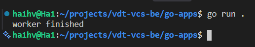
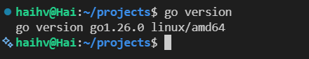
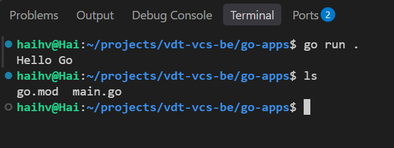
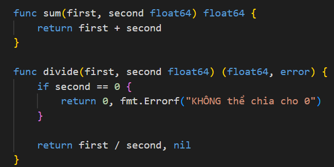
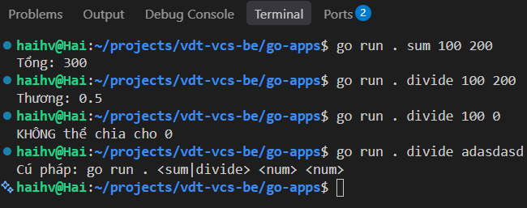

# Golang và lập trình đa luồng
**Yêu cầu**
1. Lý thuyết
+ Lịch sử ra đời
+ So sánh điểm mạnh yếu của Golang so với các ngôn ngữ khác: Python, Javascript, Java, C++
+ Golang được dùng để lập trình các ứng dụng như thế nào
+ Function: Input (Variadic function), Output (Multiple return), Error / Exception handling
+ For-loop
+ Package, Import
+ Go module
+ Naming Convetion
- Data structure
- Multithreading
- Common packages
2. Thực hành
- Setup môi trường lập trình đáp ứng nhiều project trên cùng 1 phiên IDE
- Viết các example implement tương ứng với từng mục ở phần kiến thức"

## Mục lục

- [Lý thuyết](#lý-thuyết)
- [Thực hành](#thực-hành)

## Lý thuyết

### 1. Lịch sử ra đời

Go được Google phát triển từ năm 2007. Opensource release đầu tiên năm 2009, Go 1.0 phát hành năm 2012.

Mục tiêu chính của Go là biên dịch nhanh, chạy hiệu quả, cú pháp đơn giản và dễ bảo trì.

> Tại sao sử dụng Go ?  
Go có hiệu suất vượt trội, có hỗ trợ Concurrency tích hợp sẵn, tốc độ biên dịch nhanh.  
Tối ưu trong xây dựng ứng dụng web, cli, microservices.


### 2. Điểm mạnh/yếu

| Ngôn ngữ | Điểm mạnh | Điểm mạnh của Go |
|---|---|---|
| Python |  Khoa học dữ liệu, triển khai đơn giản | Hiệu năng và việc triển khai binary |
| JavaScript/Node.js |  Hệ sinh thái web | Khả năng xử lý đồng thời, code đơn giản |
| Java |  Hệ sinh thái lâu đời | Khởi động nhanh và triển khai gọn |
| C++ |  Cú pháp đơn giản, quản lý bộ nhớ an toàn | Kiểm soát phần cứng cực thấp |

> Golang không có ưu điểm với các tác vụ ứng dụng khoa học dữ liệu, không có hệ sịnh thái lâu đời, hạn chế khả năng kiểm soát phần cứng.

### 3. Golang được dùng để lập trình các ứng dụng như thế nào

Go thường được dùng cho REST API, gRPC service (Google Remote Procedure Call), microservice, worker xử lý nền, proxy, gateway, web server, công cụ CLI, DevOps, cloud, container và các hệ thống mạng/lưu trữ.

Đối với các ngông ngữ khác:  
- Frontend trình duyệt thường dùng JavaScript/TypeScript;
- phân tích dữ liệu thường có lợi thế với Python;
- phần mềm cần điều khiển phần cứng rất chi tiết có thể chọn C/C++ hoặc Rust.

### 4. Cú pháp cơ bản

#### 4.1. Chương trình Golang cơ bản

```go
package main

import "fmt"

func main() {
	message := "Hello world!"
	fmt.Println(message)
}
```

#### 4.2. Function: input, output và variadic function

```go
func add(first, second int) int {
	return first + second
}

func divide(dividend, divisor float64) (float64, error) {
	if divisor == 0 {
		return 0, fmt.Errorf("divisor must not be zero")
	}
	return dividend / divisor, nil   
    // Hàm có thể trả về nhiều giá trị, thường sử dụng pattern error.
}

func sum(numbers ...int) int {
	total := 0
	for _, number := range numbers {
		total += number
	}
	return total
}
```


#### 4.3. Error / Exception handling

Go không dùng `try/catch` để bắt lỗi. Cú pháp bắt lỗi là hàm trả về lỗi và khi gọi sẽ kiểm tra lỗi đó:

```go
// Ví dụ bắt lỗi hàm devide().
result, err := divide(10, 0)
if err != nil {
	fmt.Println("cannot divide:", err)
	// panic("cannot run with 0")
	return
}
fmt.Println(result)
```

khi err = `nil` tức không có lỗi. 
`panic` trạng thái chỉ chương trình không nên đươc tiếp tục. dừng luồng thực thi hiện tại và bắt đầu quá trình `panic propagation`.
`panic` chỉ nên dùng cho trạng thái không thể phục hồi hoặc lỗi lập trình, không nên dùng thay cho lỗi nghiệp vụ.

#### 4.4. For-loop

Go chỉ sử dụng từ khóa `for` thể hiện lặp:

```go
for index := 0; index < 3; index++ {  // for thông dụng, đầy đủ
 	fmt.Println(index)
}

count := 3
for count > 0 { // với 1 điều kiện
	fmt.Println(count)
	count--
}

names := []string{"An", "Bình", "Chi"}
for index, name := range names {  // for với mảng
	fmt.Println(index, name)
}
```

#### 4.5. Package, import và Go module

Package sử dụng để chia chương trình thành các phần có trách nhiệm riêng. Tên hàm, biến hoặc kiểu bắt đầu bằng chữ hoa sẽ được export để package khác sử dụng.

```go
import (
	"fmt"
	"strings"
)
```

Tạo module:

```bash
go mod init example.com/hello
go mod tidy
go run .
```

File `go.mod` chứa tên module và dependency. `go.sum` lưu checksum để xác minh dependency.

#### 4.6. Naming conversion | Quy tắc đặt tên

- Dùng `MixedCaps` hoặc `mixedCaps`.
- Tên export viết hoa chữ cái đầu: `UserService`, `ParseConfig`.
- Tên không export viết thường chữ cái đầu: `userService`, `parseConfig`.
- Ngoài ra, có những cách viết đặc thù cho từ viết tắt như `HTTPServer`, `userID`, `URL`.
- Khác với python, không dùng underscore để nối từ
- file đặt tên với prefix `_`, golang tự động bỏ qua (được xác định là source file)

### 5. Cấu trúc dữ liệu

```go
numbers := []int{1, 2, 3}          // slice, kích thước thay đổi (bản chất là nằm trong 1 aray)
fixed := [3]string{"a", "b", "c"} // array, kích thước cố định
scores := map[string]int{"An": 9} // map key-value

type User struct {              // struct
	ID   int
	Name string
}

user := User{ID: 1, Name: "An"} // khai báo 1 struct
numbers = append(numbers, 4)
score, exists := scores["An"]
```

- **Array** có kích thước cố định và là một phần của kiểu dữ liệu.
- **Slice** biểu diễn danh sách động; dùng `append` để thêm phần tử.
- **Map** lưu cặp key-value; cần kiểm tra `exists` khi key có thể không tồn tại.
- **Struct** gom nhiều trường dữ liệu có kiểu khác nhau.
- **Pointer** lưu địa chỉ của một giá trị, dùng `&value` để lấy địa chỉ và `*pointer` để truy cập giá trị.

### 6. Lập trình đa luồng

Trong Go, cần phân biệt:

- **Concurrency:** Đồng thời - các công công việc có thể tiến hành xen kẽ, không cùng lúc.
- **Parallelism:** Song song - nhiều công việc thực sự chạy cùng lúc trên nhiều CPU.
- **Goroutine:** hàm chạy **Đồng thời**, tạo bằng từ khóa `go`.
- **Channel:** kênh để truyền dữ liệu và đồng bộ goroutine.

Ví dụ gửi kết quả qua channel:

```go
package main

import "fmt"

func worker(result chan<- string) {  // tham số result có kiểu là chan<- string
	result <- "worker finished"
}

func main() {
	result := make(chan string)  
	go worker(result)// nhận dữ liệu
	fmt.Println(<-result) // lấy dữ liệu
}
```


`chan<- string` chỉ cho phép gửi dữ liệu. 
Ngược lại, `<-chan string` chỉ cho phép nhận dữ liệu. Channel không có buffer sẽ chặn bên gửi cho đến khi có bên nhận.

Khi nhiều goroutine cùng truy cập, cần tránh data race. Có thể dùng `sync.WaitGroup` để chờ và `sync.Mutex` để bảo vệ dữ liệu dùng chung:

```go
var (
	mu      sync.Mutex
	counter int
)

func increment(wg *sync.WaitGroup) {
	defer wg.Done()
	mu.Lock()
	counter++
	mu.Unlock()
}
```

Trong code thực tế, nên truyền `context.Context` để hủy công việc, đặt timeout cho I/O và kiểm tra race bằng:

```bash
go test -race ./...
```

### 7. Các package thường dùng

| Package | Mục đích |
|---|---|
| `fmt` | In ra màn hình chuỗi, format, đọc input |
| `strings` | package xử lý chuỗi |
| `strconv` | Chuyển đổi chuỗi và số |
| `errors` | Tạo và kiểm tra lỗi đơn giản |
| `os` | File, biến môi trường và process |
| `io` | Đọc và ghi dữ liệu |
| `encoding/json` | Mã hóa và giải mã JSON |
| `net/http` | HTTP client và server |
| `context` | Timeout, hủy và phạm vi request |
| `sync` | Đồng bộ goroutine |
| `testing` | Unit test và benchmark |
| `log/slog` | Logging có cấu trúc |

## Thực hành

### 1. Cài đặt môi trường

1. Cài Go và kiểm tra:

   ```bash
   go version
   ```
   

2. Cài VS Code và extension Go chính thức.
3. Mở thư mục gốc của project trong VS Code.
4. Tạo mỗi project Go trong một thư mục riêng, mỗi project có một file `go.mod`.
5. Mở nhiều project trong cùng một phiên VS Code bằng `File > Add Folder to Workspace...`, sau đó dùng `File > Save Workspace As...`.
6. Chạy lệnh tại đúng thư mục chứa `go.mod`:

   ```bash
   go run .
   go test ./...
   gofmt -w .
   ```
     

### 2. Bài tập theo từng mục

- Viết hàm `sum(numbers ...int)` và kiểm thử với 0, 1 và nhiều tham số.
- Viết hàm chia số trả về `(result, error)`, xử lý trường hợp chia cho 0.
- Duyệt một slice và map bằng `for` và `range`.
- Tạo package `mathutil`, export hàm `Max` và gọi từ package `main`.
- Tạo struct `User`, lưu nhiều user trong slice và tìm user theo ID.
- Viết một worker nhận số từ channel, bình phương số đó rồi gửi kết quả về.
- Chạy `go test -race ./...` và quan sát một data race có chủ đích.

> Kết quả thực hành 2 hàm sum, divide
	  
	
### 3. Ví dụ worker pool tối giản
```go
package main

import (
	"fmt"
	"sync"
)

func worker(id int, jobs <-chan int, results chan<- int, wg *sync.WaitGroup) {
	defer wg.Done()
	for job := range jobs {
		results <- job * job
		fmt.Printf("worker %d processed %d\n", id, job)
	}
}

func main() {
	jobs := make(chan int, 4)
	results := make(chan int, 4)
	var wg sync.WaitGroup

	for id := 1; id <= 2; id++ {
		wg.Add(1)
		go worker(id, jobs, results, &wg)
	}

	for job := 1; job <= 4; job++ {
		jobs <- job
	}
	close(jobs)

	wg.Wait()
	close(results)
	for result := range results {
		fmt.Println("result:", result)
	}
}
```

`jobs` được đóng sau khi gửi xong công việc. Worker kết thúc khi `range jobs` nhận được tín hiệu channel đã đóng; `WaitGroup` bảo đảm tất cả worker hoàn thành trước khi đóng `results`.